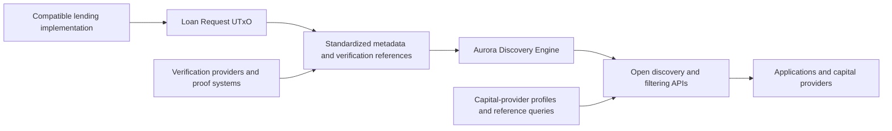

# Aurora Metadata Standard and Discovery Engine

> Open, protocol-independent infrastructure for discovering, filtering, verifying, and evaluating Cardano credit opportunities.

[](LICENSE)
[](#status)

Aurora is a shared market layer around compatible Cardano lending implementations. It standardizes how credit opportunities and verification references are described, indexes that information through the Aurora Discovery Engine, and exposes open interfaces for applications and capital providers. The resulting standards and tooling are intended to become reusable components of Cardano's credit-market stack.

Aurora does not replace lending protocols or control lending activity. The Treasury-funded scope is limited to reusable public infrastructure.

## Proposal Alignment

This repository is the primary implementation home for technical outputs defined in Aurora Treasury Proposal Version 3. The proposal itself is maintained in the [Aurora proposal repository](https://github.com/fairway-global/aurora-proposal).

| Field | Detail |
| --- | --- |
| Proposal version | **3** |
| Treasury request | **940,000 ADA** |
| Delivery period | Approximately **5 months** |
| Delivery plan | **4 implementation milestones** |
| Lead implementer | **Fairway** |
| Technical collaborator | **Sundial** |
| Technical advisor | **Fallen Icarus (Rusty)** |
| Treasury custody | Independent **3-of-5 Aurora Treasury multisignature** |
| Treasury administrators | **James "Blockjock" Meidinger, Christian Taylor, Elder Millennial, Wilco USDM, and Kriss Baird** |
| License | **Apache License 2.0** |

## Scope

### Included

- Versioned **Metadata Standard** for Aurora-compatible credit opportunities and associated metadata references.
- Extensible **Verification Framework** for institutional, eligibility, compliance, and other proof-based information.
- Open-source **Aurora Discovery Engine** for indexing, discovery, filtering, verification-information exposure, and relevant lifecycle visibility.
- **Open APIs** for compatible applications, analytics services, and capital providers.
- Published filtering and query capabilities based on open schemas.
- Open-source **Capital Discovery Layer**, including the **Capital Provider Profile Standard**, **Discovery and Filtering Specification**, **Reference Query Library**, Market Discovery API contributions, and lightweight integration artifacts.
- Developer tooling, reference implementation, integration examples, and operating documentation.
- An end-to-end testnet technical demonstration.
- Independent security and legal review of the funded infrastructure, an interim Treasury-use expenditure and reconciliation review after M2, and a final independent Treasury-use audit after M4.

### Operating Boundaries

Aurora provides market-information, discovery, filtering, and verification infrastructure. It does not:

- replace the underlying lending protocols or modify their core contracts;
- originate loans, custody lending capital, or execute funding and settlement;
- decide which opportunities receive capital or make lending, underwriting, or capital-allocation decisions;
- require a single lending protocol, identity provider, credential issuer, proof system, or verification provider;
- impose one global verification or participation policy;
- create a proprietary marketplace or capital-allocation system; or
- perform regulatory enforcement.

Funding and settlement remain functions of the compatible lending infrastructure underlying each opportunity. Participants remain responsible for their own legal, regulatory, risk, eligibility, and operational requirements.

## Architecture

Aurora operates around compatible lending infrastructure without modifying its core lending contracts.



### Processing Flow

1. **Origination.** An originator creates a Loan Request UTxO through compatible Cardano lending infrastructure. In the proposal, this means a UTxO representing an individual funding request or credit opportunity.
2. **Metadata.** The originator may attach standardized market information and verification references. The proposal describes an enriched object as a "colored" Loan Request UTxO; this is a descriptive term, not a new ledger primitive.
3. **Indexing and verification.** The Aurora Discovery Engine identifies compatible UTxOs, organizes their metadata, and exposes relevant verification information.
4. **Discovery and evaluation.** Applications and capital providers query and filter opportunities according to their own requirements.
5. **Lifecycle visibility.** Aurora indexes relevant lifecycle information made available by compatible lending implementations, including on-chain repayment events where available.
6. **Funding and settlement.** Capital allocation, loan execution, settlement, and servicing remain with the underlying lending infrastructure and relevant market participants.

Aurora exposes information for evaluation but does not make lending, underwriting, compliance, or capital-allocation decisions.

## Design Principles

- **Protocol independent.** Compatible lending implementations can use Aurora without adopting a single lending protocol.
- **Optional.** Underlying lending contracts remain independently usable without Aurora metadata.
- **Technology agnostic.** The Verification Framework does not require one identity provider, credential issuer, proof system, or verification provider.
- **Privacy compatible.** Proofs, attestations, selective disclosure, and other verification references can be used without placing sensitive source data on Cardano.
- **Extensible.** Versioned schemas support evolving market information, verification methods, jurisdictions, and participant requirements.
- **Independently operable.** Public source, deployment instructions, and open interfaces allow third parties to operate the infrastructure without a Fairway-hosted service.
- **Decision neutral.** Participants retain responsibility for their own legal, regulatory, eligibility, risk, and allocation requirements.

## Planned Repository Structure

```text
.
|-- specifications/
|   |-- metadata-standard/
|   |-- verification-framework/
|   |-- capital-provider-profile/
|   `-- discovery-and-filtering/
|-- discovery-engine/
|   |-- src/
|   |-- api/
|   `-- deployment/
|-- capital-discovery/
|   |-- reference-query-library/
|   `-- integration-artifacts/
|-- developer-tooling/
|-- reference-implementation/
|-- examples/
|-- demo/
|-- docs/
|-- LICENSE
`-- README.md
```

The structure may evolve during M1 architecture work. Any change must preserve the approved public deliverables, protocol independence, and third-party operability.

## Technical Demonstration

The testnet demonstration will show that a compatible Loan Request UTxO can be:

1. created through compatible lending infrastructure;
2. enriched with standardized metadata;
3. identified and indexed by the Aurora Discovery Engine;
4. discovered through an open API;
5. filtered according to published criteria;
6. associated with verification information that can be evaluated through the Verification Framework; and
7. consumed by a compatible reference application or query workflow.

The demonstration validates the end-to-end operation and interoperability of the infrastructure, from Loan Request UTxO creation and metadata through discovery, filtering, verification, and application-level consumption.

## Budget Allocation

The Version 3 Treasury request is allocated to public deliverables rather than separate organizational work packages. Approximate USD values use the proposal's reference price of **US$0.20 per ADA**.

| Allocation | ADA | Approx. USD | Primary scope |
| --- | ---: | ---: | --- |
| **Core Infrastructure Development** | **800,000** | **$160,000** | Standards, Discovery Engine, APIs, filtering, tooling, reference implementation, Capital Discovery Layer, demonstration, documentation, and delivery |
| **Review, Hosting & Technical Contingency** | **140,000** | **$28,000** | Independent review, Treasury-use oversight, hosting, technical operations, and approved contingency |
| **Total** | **940,000** | **$188,000** | |

The second allocation comprises approximately **60,000 ADA** for independent security and legal review, **20,000 ADA** for independent Treasury-use audit and oversight, **30,000 ADA** for hosting and technical operations, and **30,000 ADA** for technical contingency.

## Milestone Roadmap

| Milestone | Timeline | ADA allocation | Primary outcome |
| --- | --- | ---: | --- |
| **M1: Specifications and Architecture** | Month 1 | **140,000** | Core standards and implementation architecture finalized |
| **M2: Core Build** | Months 2-3 | **320,000** | Discovery, verification, indexing, filtering, and API infrastructure operational on testnet; interim Treasury-use review published |
| **M3: Integration and Technical Demonstration** | Month 4 | **290,000** | Reference implementation, developer tooling, and complete testnet workflow demonstrated |
| **M4: Independent Review and Public Release** | Month 5 | **190,000** | Independent review completed and final open-source infrastructure released |
| **Total** | **Approximately 5 months** | **940,000** | |

Public milestone evidence and progress reports will link to the relevant specifications, source code, APIs, tooling, documentation, demonstrations, and review materials.

## Delivery Roles

| Participant | Responsibility |
| --- | --- |
| **Fairway** | Lead implementation, integration, standards development, engineering, documentation, testing, external reviews, milestone evidence, and public reporting |
| **Sundial** | Selected technical contributions to capital-provider standards, discovery and filtering specifications, reference queries, API design, integration examples, and interoperability |
| **Fallen Icarus (Rusty)** | Technical advice and architectural review related to transaction-based credit markets, Loan Request UTxO design, and eUTxO-specific implementation considerations |

These roles form one integrated Aurora implementation. They do not create separate Treasury budgets, custody arrangements, governance tracks, or ownership rights over the funded public outputs.

## Treasury Governance

The full **940,000 ADA** Treasury allocation is held in one dedicated **3-of-5 Aurora Treasury multisignature** administered by James "Blockjock" Meidinger, Christian Taylor, Elder Millennial, Wilco USDM, and Kriss Baird. All five administrators are independent of the implementation participants. Fairway, Sundial, Fallen Icarus, and other implementation contributors hold no Treasury signing keys.

Expenditure may progress only after milestone evidence is published and reviewed by the Aurora Treasury Administrators. The cumulative ceilings are **140,000 ADA** at commencement, **460,000 ADA** after M1 approval, **750,000 ADA** after M2 approval, and **940,000 ADA** after M3 approval. The Core Infrastructure Development allocation is monitored against the approved deliverables and milestone outputs, with material resource-allocation changes disclosed through milestone reporting. Use of technical contingency requires written justification, administrator authorization, and disclosure in the next public milestone report; unused contingency remains unspent Treasury ADA.

Independent oversight includes an interim expenditure and reconciliation review after M2 and a final Treasury-use audit after M4. Treasury balances and transactions remain publicly auditable. Unspent ADA is returned to the Cardano Treasury if the project terminates under the proposal's conditions.

Governance details, expenditure ceilings, remediation conditions, and submission requirements are maintained in the [Aurora proposal repository](https://github.com/fairway-global/aurora-proposal).

## Status

**Proposal-aligned planning.** This repository reflects Aurora Treasury Proposal Version 3. Specifications, source code, reference tooling, documentation, and demonstration artifacts will be published against the approved milestone schedule.

## License

Unless stated otherwise, this repository is licensed under the [Apache License 2.0](LICENSE). Treasury-funded software, standards, and reference implementations may be used, operated, modified, extended, and commercialized in accordance with that license.

## Links

- [Aurora Proposal Repository](https://github.com/fairway-global/aurora-proposal)
- [Fairway](https://fairway.global)

---

Built by [Fairway Oy](https://fairway.global) with technical collaboration from Sundial Protocol and advisory input from Fallen Icarus.
