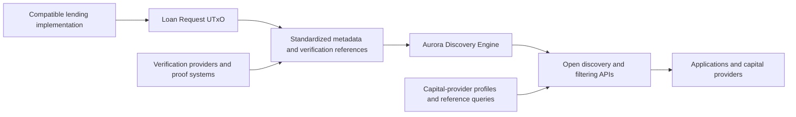

# Aurora Metadata Standard and Discovery Engine

> Open, protocol-independent infrastructure for discovering, filtering, verifying, and evaluating Cardano credit opportunities.

[](LICENSE)
[](#status)

Aurora is a shared market layer around compatible Cardano lending implementations. It standardizes how credit opportunities and verification references are described, indexes that information through the Aurora Discovery Engine, and exposes open interfaces for applications and capital providers.

Aurora does not replace lending protocols or control lending activity. The Treasury-funded scope is limited to reusable public infrastructure.

## Proposal Alignment

This repository is the primary implementation home for technical outputs defined in [Aurora Treasury Proposal Version 2](https://github.com/fairway-global/aurora-proposal).

| Field | Detail |
| --- | --- |
| Treasury request | **1,000,000 ADA** |
| Delivery period | Approximately **5 months** |
| Delivery plan | **4 implementation milestones** |
| Lead implementer | **Fairway** |
| Technical collaborator | **Sundial** |
| Technical advisor | **Fallen Icarus (Rusty)** |
| Treasury custody | Independent **3-of-5 Aurora Treasury multisignature** |
| License | **Apache License 2.0** |

## Scope

### Included

- Versioned **Metadata Standard** for Aurora-compatible credit opportunities and associated metadata references.
- Extensible **Verification Framework** for institutional, eligibility, compliance, and other proof-based information.
- Open-source **Aurora Discovery Engine** for indexing, discovery, filtering, verification-information exposure, and relevant lifecycle visibility.
- **Open APIs** for compatible applications, analytics services, and capital providers.
- Published filtering and query capabilities based on open schemas.
- **Capital Provider Profile Standard**, **Discovery and Filtering Specification**, and **Reference Query Library**.
- Developer tooling, reference implementation, integration examples, and operating documentation.
- An end-to-end testnet technical demonstration.
- Independent security and legal review of the funded infrastructure.

### Excluded

Aurora does not:

- originate or underwrite loans;
- custody or allocate lending capital;
- decide which opportunities receive funding;
- operate a proprietary lending marketplace;
- fund borrower deployment or commercial onboarding;
- convert ADA or stablecoins;
- perform fiat settlement, borrower disbursement, loan servicing, or collections; or
- require a specific lending protocol, identity provider, verification technology, settlement provider, or commercial deployment model.

Commercial lending and the activity that generates real repayment, default, and underwriting evidence remain outside the Treasury-funded scope.

## Architecture

Aurora operates around compatible lending infrastructure without modifying its core lending contracts.



### Processing Flow

1. **Origination.** An originator creates a Loan Request UTxO through a compatible Cardano lending implementation.
2. **Metadata.** The originator may attach standardized market information and verification references. The proposal describes an enriched object as a "colored" Loan Request UTxO; this is a descriptive term, not a new ledger primitive.
3. **Indexing and verification.** The Aurora Discovery Engine identifies compatible UTxOs, organizes their metadata, and exposes relevant verification information.
4. **Discovery and evaluation.** Applications and capital providers query and filter opportunities according to their own requirements.
5. **Lifecycle visibility.** Aurora indexes relevant lifecycle information made available by compatible lending implementations, including on-chain repayment events where available.
6. **Funding and settlement.** Capital allocation, loan execution, settlement, and servicing remain with the underlying lending infrastructure and relevant market participants.

Aurora exposes information for evaluation but does not make lending, underwriting, compliance, or capital-allocation decisions.

## Design Principles

- **Protocol independent.** Compatible lending implementations can use Aurora without adopting a single lending protocol.
- **Optional.** Underlying lending contracts remain independently usable without Aurora metadata.
- **Technology agnostic.** The Verification Framework does not require one identity provider, credential issuer, proof system, or verification provider.
- **Privacy compatible.** Proofs, attestations, selective disclosure, and other verification references can be used without placing sensitive source data on Cardano.
- **Extensible.** Versioned schemas support evolving market information, verification methods, jurisdictions, and participant requirements.
- **Independently operable.** Public source, deployment instructions, and open interfaces allow third parties to operate the infrastructure without a Fairway-hosted service.
- **Decision neutral.** Participants retain responsibility for their own legal, regulatory, eligibility, risk, and allocation requirements.

## Planned Repository Structure

```text
.
|-- specifications/
|   |-- metadata-standard/
|   |-- verification-framework/
|   |-- capital-provider-profile/
|   `-- discovery-and-filtering/
|-- discovery-engine/
|   |-- src/
|   |-- api/
|   `-- deployment/
|-- reference-query-library/
|-- developer-tooling/
|-- reference-implementation/
|-- examples/
|-- demo/
|-- docs/
|-- LICENSE
`-- README.md
```

The structure may evolve during M1 architecture work. Any change must preserve the approved public deliverables, protocol independence, and third-party operability.

## Technical Demonstration

The testnet demonstration will show that a compatible Loan Request UTxO can be:

1. created through compatible lending infrastructure;
2. enriched with standardized metadata;
3. identified and indexed by the Aurora Discovery Engine;
4. discovered through an open API;
5. filtered according to published criteria;
6. associated with verification information that can be evaluated through the Verification Framework; and
7. consumed by a compatible reference application or query workflow.

The demonstration validates infrastructure integration. It does not use Treasury-funded loan capital and does not require borrower deployment, fiat settlement, or commercial loan execution.

## Milestone Roadmap

| Milestone | Timeline | ADA allocation | Primary outcome |
| --- | --- | ---: | --- |
| **M1: Specifications and Architecture** | Month 1 | **150,000** | Core standards and implementation architecture finalized |
| **M2: Core Build** | Months 2-3 | **350,000** | Discovery, verification, indexing, filtering, and API infrastructure operational on testnet |
| **M3: Integration and Technical Demonstration** | Month 4 | **300,000** | Reference implementation, developer tooling, and complete testnet workflow demonstrated |
| **M4: Independent Review and Public Release** | Month 5 | **200,000** | Independent review completed and final open-source infrastructure released |
| **Total** | **Approximately 5 months** | **1,000,000** | |

Public milestone evidence and progress reports will link to the relevant specifications, source code, APIs, tooling, documentation, demonstrations, and review materials.

## Delivery Roles

| Participant | Responsibility |
| --- | --- |
| **Fairway** | Lead implementation, integration, standards development, engineering, documentation, testing, external reviews, milestone evidence, and public reporting |
| **Sundial** | Selected technical contributions to capital-provider standards, discovery and filtering specifications, reference queries, API design, integration examples, and interoperability |
| **Fallen Icarus (Rusty)** | Technical advice and architectural review related to transaction-based credit markets, Loan Request UTxO design, and eUTxO-specific implementation considerations |

These roles form one integrated Aurora implementation. They do not create separate Treasury budgets, custody arrangements, governance tracks, or ownership rights over the funded public outputs.

## Treasury Governance

The full Treasury allocation is held in one dedicated **3-of-5 Aurora Treasury multisignature**, with all five keys held independently of implementation participants. Fairway, Sundial, Fallen Icarus, and other implementation contributors hold no Treasury signing keys.

Further expenditure is conditioned on published milestone evidence and review against the approved completion criteria. Treasury balances and transactions remain publicly auditable. Unspent ADA is returned to the Cardano Treasury if the project terminates under the proposal's conditions.

Governance details, expenditure ceilings, remediation conditions, and submission requirements are maintained in the [Aurora proposal repository](https://github.com/fairway-global/aurora-proposal).

## Status

**Proposal-aligned planning.** This repository currently contains the implementation brief for Aurora Treasury Proposal Version 2. Specifications, source code, reference tooling, documentation, and demonstration artifacts will be published against the approved milestone schedule.

## License

Unless stated otherwise, this repository is licensed under the [Apache License 2.0](LICENSE). Treasury-funded software, standards, and reference implementations may be used, operated, modified, extended, and commercialized in accordance with that license.

## Links

- [Aurora Treasury Proposal](https://github.com/fairway-global/aurora-proposal)
- [Full Proposal](https://github.com/fairway-global/aurora-proposal/blob/main/proposal.md)
- [Reviewer Brief](https://github.com/fairway-global/aurora-proposal/blob/main/docs/00-reviewer-brief.md)
- [Fairway](https://fairway.global)

---

Built by [Fairway Oy](https://fairway.global) with technical collaboration from Sundial Protocol and advisory input from Fallen Icarus.
